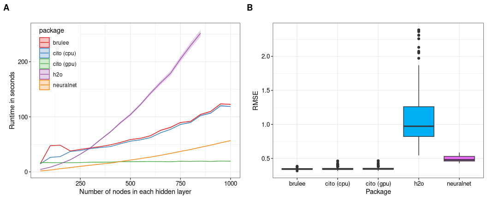

Results
================

## Benchmarking

benchmarking cito and other neural network packages

### Benchmark results

<figure>

<figcaption aria-hidden="true"><strong>Figure </strong> 1: Predictions
and ALE of bio9</figcaption>
</figure>

### Predictions and xAI

<figure>

<figcaption aria-hidden="true"><strong>Figure </strong> 2: Predictions
and ALE of bio9</figcaption>
</figure>
