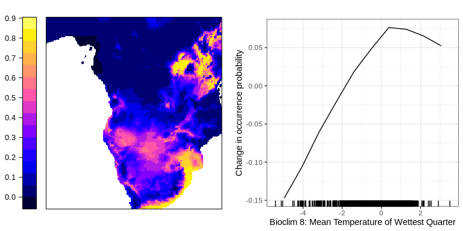
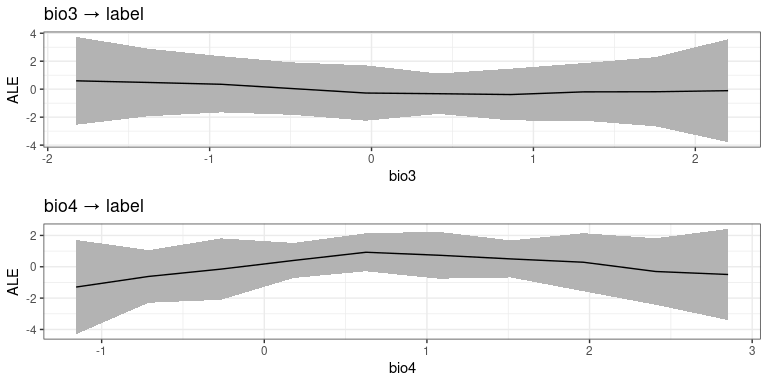

Results
================

## cito: An R package for training neural networks using torch

This repository contains the code to reproduce the results in Amesöder
et al., ‘cito’: An R package for training neural networks using torch’

### Benchmarking of runtime and error

Setup: 5 hidden layers, nodes per layer were increased from 50 to 1,000
with a stepsize of 50. Dataset contained 20 predictors (sampled from a
uniform distribution (0,1)) with 2,000 observations (1,000 were used for
training and 1,000 for evaluation (RMSE)). Each step (number of nodes)
were replicated 20 times.

Runtime analysis: Models were fit ‘cito’ version 1.1 (no runtime
difference to version 1.0.2)

SDM: Models were fit with ‘cito’ version 1.0.2

To run the benchmarking:

Results:

<figure>

<figcaption aria-hidden="true"><strong>Figure </strong> 1: Comparison of
different deep learning packages (brulee, h2o, neuralnet, and cito (CPU
and GPU)) on different network sizes on an Intel Xeon Gold 6246R and a
Nvidia RTX A5000. The networks consist of five equally sized layers (50
to 1000 nodes with a step size of 50) and are trained on a simulated
data set with 1000 observations. Panel (A) shows the runtime of the
different packages and panel (B) shows the average root mean square
error (RMSE) of the models on a holdout of size 1000 observations (RMSE
was averaged over different network sizes). Each network was trained 20
times (the dataset was resampled each time).</figcaption>
</figure>

    Warning: Removed 366 rows containing non-finite values (`stat_boxplot()`).

### Predictions and xAI

Data and code to prepare the data can be found and downloaded at
[Angelov 2020](https://doi.org/10.5281/zenodo.4048271)

To train the model run:

Results:

    Summary of Deep Neural Network Model

                  Importance  Std.Err Z value Pr(>|z|)    
    bio1 → label    0.023616 0.008313    2.84   0.0045 ** 
    bio2 → label    0.012197 0.008072    1.51   0.1308    
    bio3 → label    0.007474 0.008323    0.90   0.3692    
    bio4 → label    0.034321 0.010879    3.15   0.0016 ** 
    bio5 → label    0.010823 0.008623    1.26   0.2095    
    bio6 → label    0.017014 0.007766    2.19   0.0285 *  
    bio7 → label    0.003234 0.003104    1.04   0.2974    
    bio8 → label    0.014676 0.006043    2.43   0.0152 *  
    bio9 → label    0.030705 0.017345    1.77   0.0767 .  
    bio10 → label   0.005850 0.004487    1.30   0.1923    
    bio11 → label   0.022184 0.008805    2.52   0.0118 *  
    bio12 → label   0.030492 0.014029    2.17   0.0297 *  
    bio13 → label   0.008422 0.007007    1.20   0.2293    
    bio14 → label   0.025422 0.010734    2.37   0.0179 *  
    bio15 → label   0.036257 0.020248    1.79   0.0733 .  
    bio16 → label   0.056378 0.016814    3.35   0.0008 ***
    bio17 → label   0.008286 0.004852    1.71   0.0877 .  
    bio18 → label   0.031117 0.007020    4.43  9.3e-06 ***
    bio19 → label   0.000587 0.001422    0.41   0.6795    
    ---
    Signif. codes:  0 '***' 0.001 '**' 0.01 '*' 0.05 '.' 0.1 ' ' 1

                     ACE Std.Err Z value Pr(>|z|)    
    bio1 → label   0.374   0.193    1.93  0.05300 .  
    bio2 → label  -0.364   0.208   -1.76  0.07925 .  
    bio3 → label  -0.154   0.292   -0.53  0.59840    
    bio4 → label   0.778   0.317    2.45  0.01426 *  
    bio5 → label   0.434   0.281    1.54  0.12285    
    bio6 → label   0.456   0.184    2.48  0.01322 *  
    bio7 → label  -0.136   0.147   -0.92  0.35507    
    bio8 → label  -0.324   0.247   -1.31  0.18882    
    bio9 → label  -0.799   0.329   -2.43  0.01504 *  
    bio10 → label -0.217   0.170   -1.28  0.20168    
    bio11 → label -0.262   0.240   -1.09  0.27378    
    bio12 → label -1.094   0.312   -3.51  0.00045 ***
    bio13 → label  0.584   0.289    2.02  0.04305 *  
    bio14 → label  0.879   0.381    2.31  0.02097 *  
    bio15 → label -0.707   0.334   -2.12  0.03406 *  
    bio16 → label -1.310   0.271   -4.83  1.4e-06 ***
    bio17 → label  0.191   0.295    0.65  0.51707    
    bio18 → label  0.204   0.252    0.81  0.41849    
    bio19 → label -0.143   0.191   -0.75  0.45554    
    ---
    Signif. codes:  0 '***' 0.001 '**' 0.01 '*' 0.05 '.' 0.1 ' ' 1

                     ACE Std.Err Z value Pr(>|z|)    
    bio1 → label  0.6146  0.1374    4.47  7.7e-06 ***
    bio2 → label  0.3883  0.1319    2.94  0.00324 ** 
    bio3 → label  0.4286  0.2378    1.80  0.07146 .  
    bio4 → label  0.8362  0.2143    3.90  9.5e-05 ***
    bio5 → label  0.4515  0.2171    2.08  0.03754 *  
    bio6 → label  0.3872  0.1065    3.63  0.00028 ***
    bio7 → label  0.1786  0.0771    2.32  0.02049 *  
    bio8 → label  0.6896  0.1966    3.51  0.00045 ***
    bio9 → label  0.5394  0.2031    2.66  0.00792 ** 
    bio10 → label 0.2615  0.1115    2.34  0.01906 *  
    bio11 → label 0.5754  0.1925    2.99  0.00280 ** 
    bio12 → label 0.7462  0.2224    3.36  0.00079 ***
    bio13 → label 0.3996  0.2206    1.81  0.07009 .  
    bio14 → label 0.8651  0.2980    2.90  0.00370 ** 
    bio15 → label 0.5406  0.2302    2.35  0.01885 *  
    bio16 → label 0.8113  0.2219    3.66  0.00026 ***
    bio17 → label 0.3959  0.1487    2.66  0.00776 ** 
    bio18 → label 1.5095  0.3532    4.27  1.9e-05 ***
    bio19 → label 0.1625  0.1820    0.89  0.37193    
    ---
    Signif. codes:  0 '***' 0.001 '**' 0.01 '*' 0.05 '.' 0.1 ' ' 1

<figure>

<figcaption aria-hidden="true"><strong>Figure </strong> 2: Predictions
for the African elephant from a DNN trained by cito. Panel (A) shows the
predicted probability of occurrence of the African elephant. Panel (B)
shows the accumulated local effect plot (ALE), i.e. the change of the
predicted occurrence probability in response to the Bioclim variable 8
(mean temperature of the wettest quarter).</figcaption>
</figure>

<figure>

<figcaption aria-hidden="true"><strong>Figure </strong> 3: Predictions
for the African elephant from a DNN trained by cito. Panel (A) shows the
predicted probability of occurrence of the African elephant. Panel (B)
shows the accumulated local effect plot (ALE), i.e. the change of the
predicted occurrence probability in response to the Bioclim variable 8
(mean temperature of the wettest quarter).</figcaption>
</figure>

### Session info

    R version 4.2.3 (2023-03-15)
    Platform: x86_64-pc-linux-gnu (64-bit)
    Running under: Ubuntu 20.04.6 LTS

    Matrix products: default
    BLAS:   /usr/lib/x86_64-linux-gnu/openblas-pthread/libblas.so.3
    LAPACK: /usr/lib/x86_64-linux-gnu/openblas-pthread/liblapack.so.3

    locale:
     [1] LC_CTYPE=en_US.UTF-8       LC_NUMERIC=C              
     [3] LC_TIME=en_US.UTF-8        LC_COLLATE=en_US.UTF-8    
     [5] LC_MONETARY=en_US.UTF-8    LC_MESSAGES=en_US.UTF-8   
     [7] LC_PAPER=en_US.UTF-8       LC_NAME=C                 
     [9] LC_ADDRESS=C               LC_TELEPHONE=C            
    [11] LC_MEASUREMENT=en_US.UTF-8 LC_IDENTIFICATION=C       

    attached base packages:
    [1] stats     graphics  grDevices utils     datasets  methods   base     

    other attached packages:
     [1] h2o_3.44.0.3        brulee_0.3.0        neuralnet_1.44.2   
     [4] maptools_1.1-6      latticeExtra_0.6-30 lattice_0.20-45    
     [7] rsample_1.1.1       raster_3.6-20       sp_1.6-0           
    [10] cito_1.0.2          gridExtra_2.3       lubridate_1.9.2    
    [13] forcats_1.0.0       stringr_1.5.0       dplyr_1.1.1        
    [16] purrr_1.0.1         readr_2.1.4         tidyr_1.3.0        
    [19] tibble_3.2.1        ggplot2_3.4.1       tidyverse_2.0.0    

    loaded via a namespace (and not attached):
     [1] bit64_4.0.5        jsonlite_1.8.4     progress_1.2.2     yaml_2.3.7        
     [5] globals_0.16.2     pillar_1.9.0       backports_1.4.1    glue_1.6.2        
     [9] torch_0.11.0       digest_0.6.31      RColorBrewer_1.1-3 checkmate_2.1.0   
    [13] colorspace_2.1-0   htmltools_0.5.5    pkgconfig_2.0.3    listenv_0.9.0     
    [17] scales_1.2.1       processx_3.8.0     terra_1.7-18       jpeg_0.1-10       
    [21] tzdb_0.3.0         timechange_0.2.0   generics_0.1.3     farver_2.1.1      
    [25] withr_2.5.0        furrr_0.3.1        cli_3.6.1          crayon_1.5.2      
    [29] magrittr_2.0.3     deldir_1.0-6       evaluate_0.20      ps_1.7.3          
    [33] future_1.32.0      fansi_1.0.4        parallelly_1.35.0  foreign_0.8-84    
    [37] prettyunits_1.1.1  tools_4.2.3        hms_1.1.3          lifecycle_1.0.3   
    [41] interp_1.1-3       munsell_0.5.0      callr_3.7.3        compiler_4.2.3    
    [45] parabar_1.1.1      rlang_1.1.3        grid_4.2.3         RCurl_1.98-1.12   
    [49] rstudioapi_0.14    bitops_1.0-7       labeling_0.4.2     rmarkdown_2.21    
    [53] gtable_0.3.3       codetools_0.2-19   R6_2.5.1           knitr_1.42        
    [57] fastmap_1.1.1      bit_4.0.5          utf8_1.2.3         filelock_1.0.2    
    [61] coro_1.0.3         stringi_1.7.12     parallel_4.2.3     Rcpp_1.0.10       
    [65] vctrs_0.6.1        png_0.1-8          tidyselect_1.2.0   xfun_0.38         
